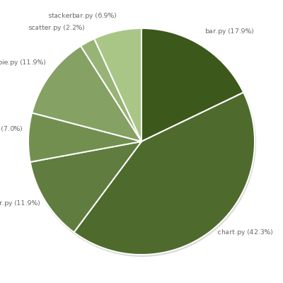
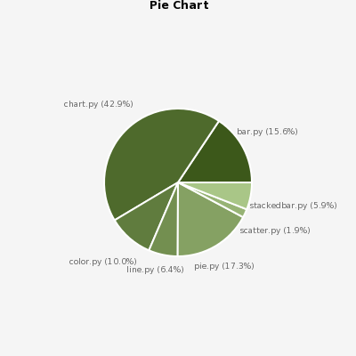

=============
Release notes
=============

Release 0.6.0
-------------

`Pycha 0.6.0`_  was released the 31th of December, 2010.

.. _Pycha 0.6.0: http://pypi.python.org/pypi/pycha/0.6.0

Autopadding
^^^^^^^^^^^

Until this release the padding options were used to manually make room for
the chart given the surface dimensions. Users needed to adjust the padding in
order to make the tick labels and other elements render correctly.

With this release Pycha guarantees that all the chart elements will be
rendered in the surface area even when a zero padding is used. Thus now the
padding options are really.. padding!

This was not very difficult for all charts except for pie charts. You can
learn more abouth the algorithm used in that case in `Lorenzo's blog`_

.. _Lorenzo's blog: http://www.lorenzogil.com/blog/2010/07/26/pie-charts-autopadding/

   Pie chart in 0.5.3

   Example of pie chart with padding set to 0 and not autopadding

   Pie chart in 0.6.0

   Example of pie chart with padding set to 0 and autopadding

Better documentation
^^^^^^^^^^^^^^^^^^^^

In this release the documentation have been revamped and uploaded to
`packages.python.org/pycha`_. It has been restructured and updated and while
it is not finished yet, it will keep being improved.

.. _packages.python.org/pycha: http://packages.python.org/pycha

Other changes
^^^^^^^^^^^^^

A lot of bugs have been fixed and a buildout configuration file have been
included to build the dependencies easily.

Release 0.5.0
-------------

`Pycha 0.5.0`_  was released the 22th of March, 2009.

.. _Pycha 0.5.0: http://pypi.python.org/pypi/pycha/0.5.0

Stacked Bar Charts
^^^^^^^^^^^^^^^^^^

.. Image:: _static/vstackedbarchart.png

Pycha now support stacked bar charts. You can see examples of them in the file
``examples/stackedbarchart.py``. The new module is called
``pycha.stackedbarchart`` and it contains two new charts:

* StackedVerticalBarChart
* StackedHorizontalBarChart

Custom Colors
^^^^^^^^^^^^^

One common request among Pycha users was using custom colors in the charts.
Until now Pycha always computed the different colors for each dataset by
lightening the initial color provided by the user. Now, much powerful and
flexible colors can be used.

In the ``pycha.color`` module there is a class called ``ColorScheme``. Every
subclass of this class is registered in a special registry and available in
the chart options under the key **colorScheme.name**. Pycha now provides three
different color schemes but users can write as many as they want. The three
different color schemes are:

* Gradient: for old nice pycha colors
* Fixed: for fixed user specified colors
* Rainbow: for rainbow colors

You can use these schemes puting their lowercase names in the key mentioned above.
For example, to use the Rainbow color scheme your options would look like::

  options = {
      'colorScheme': {
          'name': 'rainbow',
          },
       }

If the color scheme needs additional arguments you put them in the
**colorScheme.args** option. For example, the Fixed color scheme needs a list
with the colors for each dataset::

  options = {
      'colorScheme': {
          'name': 'fixed',
          'args': {
              'colors': ['#ff0000', '#00ff00'],
              },
          },
       }

Check the docstring of each Color Scheme subclass to learn about its optional
and mandatory arguments.

.. Image:: _static/gradient.png
.. Image:: _static/fixed.png
.. Image:: _static/rainbow.png

**Important**: this feature introduces a backwards imcompatible change because until
Pycha 0.4.2 the option **colorScheme** was a string and not a dictionary.
That string was the initial color used in the old gradient color scheme used
by Pycha. You can either remove the key from your options and still get the
gradient since it's the default color scheme in Pycha, or update the
options like this::

  options = {
      'colorScheme': {
          'name': 'gradient',
          'args': {
              'initialColor': your_color_here,
               },
          },
      }
